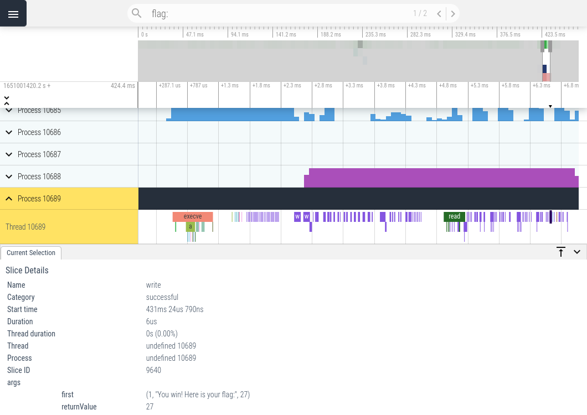

# strace-perfetto

strace-perfetto runs strace and converts the raw output to a [Trace Event](https://docs.google.com/document/d/1CvAClvFfyA5R-PhYUmn5OOQtYMH4h6I0nSsKchNAySU/edit#heading=h.yr4qxyxotyw) JSON file. The JSON file can then be analyzed using Google's [Perfetto UI](https://ui.perfetto.dev/)



### Install
```
go install github.com/lbirchler/strace-perfetto@latest
```

### Usage
```
Usage: strace-perfetto [OPTIONS] command
  -e string
        only trace specified syscalls
  -o string
        json output file (default "stracefile.json")
  -t int
        strace timeout (secs) (default 10)
```

### Examples
#### Trace program/script/command
```
$ strace-perfetto ./x.py
```

<details>
<summary>JSON output</summary>

```
$ jq '.[-3:]' stracefile.json                                                                                                            
[
  {
    "name": "munmap",
    "cat": "successful",
    "ph": "X",
    "pid": 83283,
    "tid": 83283,
    "ts": 1651010489317416,
    "dur": 27,
    "args": {
      "first": "(0x7fc75d49f000, 262144)",
      "returnValue": "0"
    }
  },
  {
    "name": "munmap",
    "cat": "successful",
    "ph": "X",
    "pid": 83283,
    "tid": 83283,
    "ts": 1651010489317475,
    "dur": 25,
    "args": {
      "first": "(0x7fc79f115000, 262144)",
      "returnValue": "0"
    }
  },
  {
    "name": "munmap",
    "cat": "successful",
    "ph": "X",
    "pid": 83283,
    "tid": 83283,
    "ts": 1651010489317520,
    "dur": 24,
    "args": {
      "first": "(0x7fc79eef8000, 262144)",
      "returnValue": "0"
    }
  }
]
```
</details>


#### Trace specific syscalls
```
$ strace-perfetto -e symlink,unlink,openat ./x.py 
```
<details> 
<summary>JSON output</summary>

```
$ jq '.[-3:]' stracefile.json 
[
  {
    "name": "symlink",
    "cat": "successful",
    "ph": "X",
    "pid": 85018,
    "tid": 85018,
    "ts": 1651015267210572,
    "dur": 12,
    "args": {
      "first": "(\"/flag\", \"x\")",
      "returnValue": "0"
    }
  },
  {
    "name": "unlink",
    "cat": "successful",
    "ph": "X",
    "pid": 85018,
    "tid": 85018,
    "ts": 1651015267210598,
    "dur": 14,
    "args": {
      "first": "(\"x\")",
      "returnValue": "0"
    }
  },
  {
    "name": "openat",
    "cat": "successful",
    "ph": "X",
    "pid": 85018,
    "tid": 85018,
    "ts": 1651015267210626,
    "dur": 34,
    "args": {
      "first": "(AT_FDCWD, \"x\", O_WRONLY|O_CREAT|O_CLOEXEC, 0777)",
      "returnValue": "3"
    }
  }
]
```
</details>


#### Kill trace after *n* seconds 
```
$ strace-perfetto -t 2 ./x.py 
```

**NOTE:** The *cat (category)* field for each event is used to represent the status of each syscall
```
successful: syscall returned without an error code
failed:     syscall returned with an error code
unfinished: syscall didn't finish
detached:   strace detached from syscall before returning due to another one being called by a different thread/process
```
